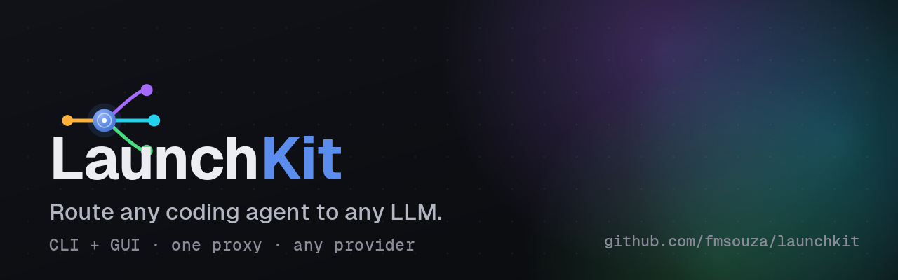

# LaunchKit

LaunchKit is a dual-mode (CLI + GUI) desktop app that lets coding-agent harnesses
(Claude Code, Codex, opencode, openclaw, …) talk to any LLM provider. It runs a small
proxy on loopback that receives requests in the Anthropic or OpenAI wire format, resolves
a model **alias** to a concrete provider + model, and streams the response back via the
[Vercel AI SDK](https://sdk.vercel.ai). You manage providers, API keys, routing aliases,
and session history from the GUI; the CLI launches harnesses and edits config from the
terminal.

## Download & install

Grab a prebuilt binary from the [**latest release**](https://github.com/fmsouza/launchkit/releases/latest)
— no toolchain required. The download links below always resolve to the newest stable
release.

### Platform support

| Platform | GUI app | CLI binary | Download |
|---|:---:|:---:|---|
| **macOS** — Apple Silicon (`arm64`) | ✅ | ✅ | [app](https://github.com/fmsouza/launchkit/releases/latest/download/launchkit-darwin-arm64-app.tar.gz) · [cli](https://github.com/fmsouza/launchkit/releases/latest/download/launchkit-darwin-arm64-cli.tar.gz) |
| **macOS** — Intel (`x64`) | ✅ | ✅ | [app](https://github.com/fmsouza/launchkit/releases/latest/download/launchkit-darwin-x64-app.tar.gz) · [cli](https://github.com/fmsouza/launchkit/releases/latest/download/launchkit-darwin-x64-cli.tar.gz) |
| **Linux** — `x64` | ✅ | ✅ | [app](https://github.com/fmsouza/launchkit/releases/latest/download/launchkit-linux-x64-app.tar.gz) · [cli](https://github.com/fmsouza/launchkit/releases/latest/download/launchkit-linux-x64-cli.tar.gz) |
| **Linux** — `arm64` | ✅ | ✅ | [app](https://github.com/fmsouza/launchkit/releases/latest/download/launchkit-linux-arm64-app.tar.gz) · [cli](https://github.com/fmsouza/launchkit/releases/latest/download/launchkit-linux-arm64-cli.tar.gz) |
| **Windows** — `x64` | ✅ | ✅ | [app](https://github.com/fmsouza/launchkit/releases/latest/download/launchkit-windows-x64-app.zip) · [cli](https://github.com/fmsouza/launchkit/releases/latest/download/launchkit-windows-x64-cli.zip) |

LaunchKit runs GUI + CLI on macOS, Linux, and Windows. Provider API keys are stored in the
platform's secret store — macOS Keychain, Linux Secret Service (libsecret), or Windows DPAPI —
so stored-key proxy routing works on all three. On a headless Linux box with no keyring, set
`LAUNCHKIT_SECRET_PASSPHRASE` to enable an encrypted-file fallback (LaunchKit never writes secrets
in plaintext). Code signing / notarization is not yet applied, so you may need to allow the app past
your OS's first-run gatekeeper.

### macOS — GUI app

Apple Silicon (`arm64`); for an Intel Mac swap `darwin-arm64` → `darwin-x64` and
`dev-macos-arm64` → `dev-macos-x64`.

```sh
curl -L -o launchkit-app.tar.gz \
  https://github.com/fmsouza/launchkit/releases/latest/download/launchkit-darwin-arm64-app.tar.gz
tar xzf launchkit-app.tar.gz

# the build is unsigned — clear the Gatekeeper quarantine flag, then install
xattr -dr com.apple.quarantine dev-macos-arm64/LaunchKit-dev.app
cp -R dev-macos-arm64/LaunchKit-dev.app /Applications/
open /Applications/LaunchKit-dev.app
```

On launch the GUI starts a loopback proxy on `127.0.0.1:4000` and adds a menu-bar tray
icon (launch a harness or quit from there).

### macOS / Linux — CLI

Pick the archive for your platform (`darwin-arm64`, `darwin-x64`, `linux-x64`, or
`linux-arm64`):

```sh
PLATFORM=darwin-arm64   # darwin-x64 | linux-x64 | linux-arm64
curl -L "https://github.com/fmsouza/launchkit/releases/latest/download/launchkit-${PLATFORM}-cli.tar.gz" | tar xz
chmod +x "launchkit-${PLATFORM}-cli"
sudo mv "launchkit-${PLATFORM}-cli" /usr/local/bin/launchkit   # put it on your PATH

# on macOS the first run may be quarantined — if it won't launch:
# xattr -d com.apple.quarantine /usr/local/bin/launchkit

launchkit list harnesses
```

### Linux — GUI app

```sh
PLATFORM=linux-x64   # or linux-arm64
curl -L -o launchkit-app.tar.gz \
  "https://github.com/fmsouza/launchkit/releases/latest/download/launchkit-${PLATFORM}-app.tar.gz"
tar xzf launchkit-app.tar.gz
./dev-${PLATFORM}/LaunchKit-dev/bin/launcher
```

### Windows — CLI (PowerShell)

```powershell
Invoke-WebRequest -OutFile launchkit-cli.zip `
  https://github.com/fmsouza/launchkit/releases/latest/download/launchkit-windows-x64-cli.zip
Expand-Archive launchkit-cli.zip
# move to a directory on your PATH
Move-Item launchkit-windows-x64-cli\launchkit.exe C:\Windows\System32\launchkit.exe
launchkit list harnesses
```

### Windows — GUI app

The build is unsigned — Windows SmartScreen may prompt on first launch. Click
**More info** → **Run anyway** to proceed.

```powershell
Invoke-WebRequest -OutFile launchkit-app.zip `
  https://github.com/fmsouza/launchkit/releases/latest/download/launchkit-windows-x64-app.zip
Expand-Archive launchkit-app.zip
.\dev-windows-x64\LaunchKit-dev\bin\launcher.exe
```

### Verify the download (optional)

Every release ships a `checksums-sha256.txt`. After downloading one or more assets into
the current directory:

```sh
curl -LO https://github.com/fmsouza/launchkit/releases/latest/download/checksums-sha256.txt
shasum -a 256 -c checksums-sha256.txt --ignore-missing
```

Prefer the bleeding edge? Every push to `main` publishes a
[pre-release canary](https://github.com/fmsouza/launchkit/releases) (`vX.Y.Z-canary.N`)
with the same set of assets — unstable, but current.

## Build from source

### Requirements

- **macOS, Linux, or Windows.** Building the GUI produces a bundle for your host platform
  (`dev-<os>-<arch>`, e.g. `dev-macos-arm64`).
- **Bun ≥ 1.3.14** (the repo pins `bun@1.3.14`). Install from <https://bun.sh>.

Bootstrap the workspace once:

```sh
bun install
```

## Build & run the GUI app

```sh
cd apps/desktop && bunx electrobun build
```

This produces an unsigned development bundle under `apps/desktop/build/dev-<os>-<arch>/`
for your host platform, e.g. on Apple Silicon:

```
apps/desktop/build/dev-macos-arm64/LaunchKit-dev.app
```

(The first build may download Electrobun core binaries. Substitute your own
`dev-<os>-<arch>` directory — e.g. `dev-macos-x64`, `dev-linux-x64` — in the commands
below.)

Install or run it:

```sh
# run in place
open apps/desktop/build/dev-macos-arm64/LaunchKit-dev.app

# or install it
cp -R apps/desktop/build/dev-macos-arm64/LaunchKit-dev.app /Applications/
```

Because the build is **unsigned**, macOS Gatekeeper may block the first launch. Either
right-click the app → **Open** (then confirm), or strip the quarantine attribute:

```sh
xattr -dr com.apple.quarantine apps/desktop/build/dev-macos-arm64/LaunchKit-dev.app
```

On launch the GUI starts a loopback proxy on `127.0.0.1:4000` and adds a menu-bar tray
icon (launch a harness or quit from there).

## Build & use the CLI

Compile the standalone CLI binary from the repo root:

```sh
bun run --filter launchkit compile
```

This outputs a self-contained executable at `apps/desktop/dist/launchkit-cli`.

The command surface:

```sh
# list what's configured
./apps/desktop/dist/launchkit-cli list harnesses
./apps/desktop/dist/launchkit-cli list providers
./apps/desktop/dist/launchkit-cli list models

# launch a harness (uses its default model unless --model overrides)
./apps/desktop/dist/launchkit-cli launch claude
./apps/desktop/dist/launchkit-cli launch claude --model fast

# add / remove a provider (secrets are NOT set here — see "Configure providers")
./apps/desktop/dist/launchkit-cli add provider --id openai --name OpenAI --sdk openai
./apps/desktop/dist/launchkit-cli remove provider openai

# add / remove a model
./apps/desktop/dist/launchkit-cli add model --name fast --provider openai --model gpt-4o-mini
./apps/desktop/dist/launchkit-cli remove model fast
```

`launch` ensures a proxy is up: it reuses a proxy already running on `127.0.0.1:4000`
(e.g. one started by the GUI), otherwise it starts an ephemeral one with a freshly
generated per-run key.

## Configure providers

Provider API keys are added from the GUI **Providers** page, never from the CLI. Keys are
stored in the platform's secret store — macOS Keychain, Linux Secret Service (libsecret),
or Windows DPAPI — and `config.json` holds only a reference to each key, never the value.
(`launchkit add provider` creates a provider with empty secrets; you then set the key in
the GUI.)

Map your model **aliases** (`default`, `fast`, `smart`, `local`) to a provider + model on
the GUI **Models** page. Harnesses request an alias, and the proxy routes it to the
configured provider/model. The "default" option bypasses the proxy entirely and launches
the harness with its own native credentials/model.

## Development

Run the full gate from the repo root before committing:

```sh
bun run typecheck && bun run lint && bun test
```

`bun test` alone runs the test suite. For an end-to-end runtime check (builds the app,
launches it, probes `/health` on loopback, then cleans up):

```sh
bash apps/desktop/scripts/smoke.sh
```

For the GUI-specific smoke checklist that can't be automated (window, tray, native
folder dialog, live xterm round-trip), see
[`apps/desktop/MANUAL-VERIFICATION.md`](apps/desktop/MANUAL-VERIFICATION.md).

## Project layout

- `packages/*` — the functional backend: `proxy`, `harnesses`, `config`, `secrets`,
  `sessions`, `cli`, `ipc`, `pty`, `ui`, `types`, `utils`.
- `apps/desktop` — the Electrobun shell (window, tray, IPC) + the React UI; the one place
  real effects (fs, keychain, sqlite, process, server) are constructed and injected.
- `tooling/` — shared config presets (Biome, tsconfig).

## Contributing / extending

The rulebook for any agent working in this repo is the **root `CLAUDE.md`** — it
covers TypeScript style, functional layering, TDD, atomic design for the React UI,
security, performance, and package boundaries. For per-package context (responsibility,
public API, owned effects, local invariants), read that package's `CLAUDE.md` (every
package and `apps/desktop` has one).

Workflow skills live under `.claude/skills/` and cover recurring LaunchKit-specific
tasks:

| Skill | When to use it |
|---|---|
| `launchkit-new-package` | Creating a new internal package under `packages/` |

All other process (TDD, planning, review, debugging) is covered by the superpowers
skills — invoke `using-superpowers` at the start of a session.

> **GitHub social preview:** upload `assets/launchkit-og-card.png` at
> Settings → General → Social preview. (Manual; cannot be automated.)
